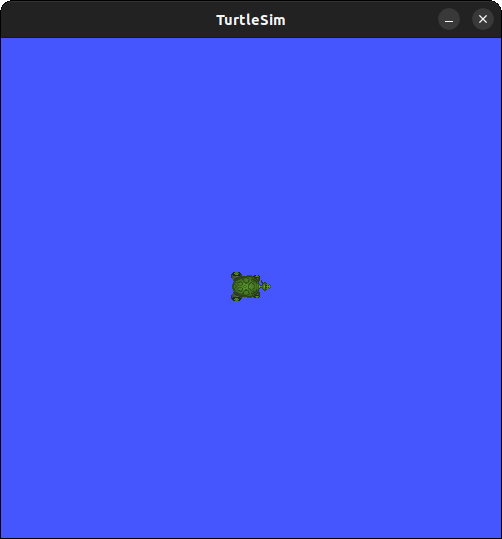

# ⭐ *Large Model and Reinforcement Learning Integration for Autonomous Robotic Navigation*

## 🔥Feature
🔥Advanced Reinforcement Learning Algorithms: The framework includes classic algorithms like DQN, DDPG, PPO, SAC, as well as recent advancements such as GTRL, Multimodal CLI, GDAE, tailored for goal-driven navigation tasks in reinforcement learning.

🔥ROS Integration: Seamlessly interacts with the Robot Operating System (ROS) to enable comprehensive robotic control.

🔥Leverages LLM and VFM: Harnesses the power of Large Language Models (LLM) and Vision-based Feature Models (VFM) for advanced decision-making and efficient task management.

🔥Utilizes LLM-based systems: Employs LLM-based systems for tasks like motion and navigation, interpreting language model outputs for precise control.

🔥Creates interactive robot control experiences swiftly: Develops interactive robot control experiences rapidly, often completing setups in under ten minutes.

## 📆✅Update
| Date       | Updates                                                                                                                         | Address |
|------------|---------------------------------------------------------------------------------------------------------------------------------|---------|
| 2023-12-01 | Implemented DQN, DDPG, SAC, TD3.                                                                                                | LMRL-RL |
| 2024-01-12 | Implemented Multidomol-GIL, PPO, and TD3-GRU algorithms.                                                                        | LMRL-RL |
| 2024-01-14 | Added multiple test scenarios, including one with complex pedestrian movements and multiple scenarios with complex obstacles.   | Env     |
| 2024-01-20 | Completed testing for some algorithms in GAZEBO, added to README.                                                               | README  |
| 2024-01-24 | Added ChatGPT interface in ROS, implemented demo controlling a turtle with ChatGPT.                                             | LLM     |
| 2024-01-27 | Added interfaces for basic vision models in ROS, such as SAM, FastSAM, CaptionAnything, and YOLO.                               | VFM     |


## 📆✅Future Plan
- **Agent Mechanism**: Adding an agent mechanism allows long sequence tasks to be well divided.

- **Feedback Channel from External Functions**: We plan to add a feedback mechanism for the robot to receive information from external functions. This would significantly assist model-based decision-making processes.

- **Navigation Interface**: A new interface for robot navigation is also in the pipeline. It will enable the utilization of this framework in navigation-oriented tasks.


## ✨Weights for RL
|     Weights      |                           Links                            |     Weights      |                           Links                            |
|:----------------:|:----------------------------------------------------------:|:----------------:|:----------------------------------------------------------:|
|      **DQN**     | [DQN](http://host.robots.ox.ac.uk/pascal/VOC/)             |      **DDPG**    | [DDPG](http://host.robots.ox.ac.uk/pascal/VOC/)             |
|      **PPO**     | [PPO](http://host.robots.ox.ac.uk/pascal/VOC/)             |      **SAC**     | [SAC](http://host.robots.ox.ac.uk/pascal/VOC/)              |
|      **GTRL**    | [GTRL](http://host.robots.ox.ac.uk/pascal/VOC/)            | **Multimodal CLI** | [Multimodal CLI](http://host.robots.ox.ac.uk/pascal/VOC/)   |
|      **GDAE**    | [GDAE](https://github.com/cs-chan/Exclusively-Dark-Image-Dataset/tree/master/Dataset) |                   |                                                             |


## 🔥Performance in our own env
|                    |
|:----------------------------------------------------------------------------------------------------|
| *Performance comparisons with state-of-the-art methods on the Dior\_Foggy and Dior\_Severe\_Foggy.* | *Performance comparisons with state-of-the-art methods on the RTTS*     |


## 👀Demo for controlling turtlesim

Prompt:

```shell
Move turtle1 left by 2, then rotate 180 degrees, and move back to (5, 5). Finally, spawn a turtle named turtle2 at (10, 10) and remove turtle1.
```

<p align="center">
    
</p>

## 👀Demo for Segment anything model

|                                                                                                                              |
|:-----------------------------------------------------------------------------------------------------------------------------------------------------------------------------------------------------------|
| *RGB images from the fisheye camera stacked for the most recent four frames. The top pair of figures show the raw RGB images, whereas those on the bottom display the images after being processed by SAM* |
